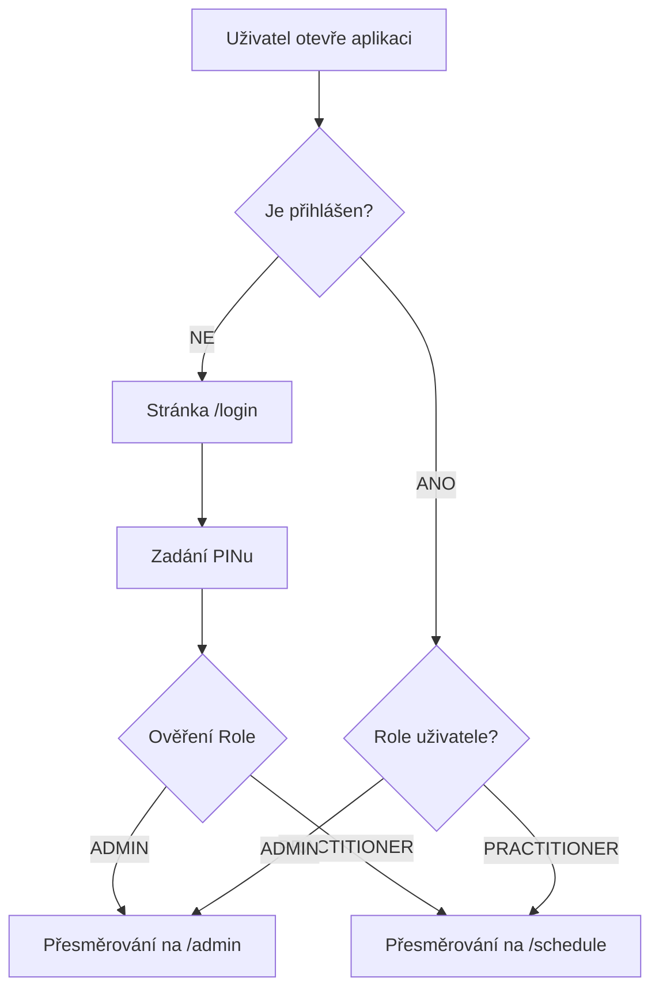

# Dokumentace projektu Centrum Unity

## 1. Přehled projektu
**Název:** Centrum Unity (Wellness Marketplace)
**Popis:** Komplexní platforma pro správu wellness centra, která propojuje klienty s terapeuty, kouči a lektory. Aplikace umožňuje správu rezervací, profilů praktiků a administraci studia.

## 2. Technologický Stack
- **Frontend:** React 19, TypeScript, Vite
- **Backend:** Express.js (Node.js) integrovaný s Vite (SSR/Middleware mód pro vývoj)
- **Kompilace (Build):** `esbuild` pro sjednocení backendu do `dist/server.cjs`
- **State Management:** Zustand (globální store pro uživatele, rezervace a události)
- **Styling:** Tailwind CSS (včetně vlastních barevných palet `sage` a `stone`)
- **Routing:** React Router Dom v7
- **Data & Backend:** 
  - Firebase (Firestore pro data, Functions pro logiku)
  - Lokální mock data (pro vývoj/demo režim)
- **AI & Integrace:**
  - Google Gemini API (AI Chatbot, `@google/genai` v2.x)
  - Resend (E-mailové notifikace - simulace browser SDK)
  - Recharts (Grafy a analytika)
- **Ikony:** Lucide React

## 3. Adresářová Struktura
```
/
├── components/         # Znovupoužitelné UI komponenty
│   ├── AIChatBot.tsx   # Plovoucí AI asistent
│   ├── Button.tsx      # Univerzální tlačítko
│   ├── PractitionerCard.tsx # Karta terapeuta
│   ├── RescheduleModal.tsx  # Modální okno pro změnu termínu
│   └── Toast.tsx       # Notifikace
├── contexts/           # React Context (Global State)
│   └── ToastContext.tsx # Správa toast zpráv
├── pages/              # Hlavní stránky aplikace
│   ├── Login.tsx       # Přihlášení (PIN/Heslo)
│   ├── StudioSchedule.tsx # Kalendář pro praktiky
│   ├── AdminDashboard.tsx # Admin panel (přehledy, správa lidí)
│   └── ... (About, Team, Services - statické stránky)
├── services/           # Logika pro komunikaci s API
│   ├── firebase.ts     # Firestore, Auth, Resend wrapper
│   ├── geminiService.ts # Komunikace s AI modelem
│   ├── monitoring.ts   # Analytika (Google Analytics wrapper)
│   └── notifications.ts # Logika posílání notifikací
├── utils/              # Pomocné funkce
│   └── scheduler.ts    # Logika pro generování slotů v kalendáři
├── App.tsx             # Hlavní router a layout
├── constants.ts        # Konstanty a mock data (PRACTITIONERS)
└── types.ts            # TypeScript definice (Booking, Practitioner)
```

## 4. Logická Mapa Aplikace

### A. Tok Autentizace (Auth Flow)


### B. Tok Rezervace a storna (Booking Flow)
1. **Výběr:** Praktik vybere volný slot v kalendáři (`StudioSchedule`).
2. **Formulář:** Vyplní údaje o klientovi a typu služby.
3. **Uložení:** 
   - Aktualizace lokálního stavu (`setBookings`).
   - Odeslání do Firestore (`saveBookingToFirestore`).
   - Odeslání e-mailu potvrzení (`sendTransactionalEmail`).
4. **Zobrazení:** Slot se v kalendáři změní na "Obsazeno".
5. **Zrušení/Přesun:** Změny přes `cancelBooking` a `adminRescheduleBooking` se okamžitě projevují jak v lokálním storu aplikaci, tak zpětným zápisem do Firestore (`updateBookingInFirestore`).

### C. Tok Skupinové Události (Public Event Flow)
1. **Vytvoření:** Manažer vytvoří `GroupEvent` pro Velkou místnost s kapacitou a cenou.
2. **Sdílení:** Vygeneruje se veřejná URL (např. `/event/:eventId/book`).
3. **Přihlášení:** Klient otevře URL, vidí zbývající kapacitu a vyplní údaje.
4. **Zápis (Transakce):** Vytvoří se `EventRegistration`. Firestore transakce ověří, že počet existujících registrací nepřekročil kapacitu události.

### D. Administrátorský Tok
1. **Dashboard:** Zobrazení metrik (Příjmy, Vytíženost) a přehledu rezervací.
2. **Master Kalendář:** Admin vidí přehledný kalendář se všemi rezervacemi. Na rozdíl od běžných praktiků (kteří u své rezervace vidí obecné "MOJE AKCE"), administrátor vidí konkrétní jména terapeutů, což zajišťuje maximální přehled nad personální organizací.
3. **Správa Terapeutů:** Přidání/Editace profilů v `AdminDashboard`.
4. **Správa Rezervací a Událostí:** Admin může přesunout/zrušit 1-on-1 rezervace a spravovat skupinové události (vytváření, úprava, mazání).
    - **Řešení kolizí (Conflict Resolution):** Pokud se admin pokusí vytvořit skupinovou událost v čase, kdy má lektor již vytvořenou běžnou rezervaci, systém detekuje kolizi a automaticky otevře modální okno pro přesun (Reschedule) lektorovy rezervace. Po úspěšném přesunu může admin dokončit vytvoření události.

## 5. Klíčové Datové Modely (`types.ts`)

### Role
- `ADMIN`: Plný přístup, vidí vše.
- `PRACTITIONER`: Vidí jen kalendář a své rezervace.
- `CLIENT`: (Zatím nevyužito pro přihlášení, jen jako role v datech). // Prepared for Phase 2 client portal

### Booking (Rezervace)
- `id`: Unikátní identifikátor.
- `room`: 1 (Malá) nebo 2 (Velká).
- `status`: 'confirmed' | 'cancelled'.
- `paymentStatus`: 'paid' | 'unpaid' | 'invoice_pending'.
- `paymentId`: ID platby v platební bráně (GoPay) pro párování a refundace.
- `clientEmail` / `clientPhone`: Kontaktní údaje pro hosty a jednorázové klienty.
- `bookedByUserId`: ID terapeuta, který rezervaci vytvořil.

### Practitioner (Praktik)
- `id`, `name`, `title`, `role`, `pin`
- `specialization`, `bio`, `imageUrl`
- `services`: Seznam nabízených služeb.
- `colorCode`: Unikátní Tailwind CSS třída pro barevné odlišení v kalendáři.
- **Řazení lektorů v UI:** Lektori jsou v aplikaci (i v administrátorském výběru) vždy seřazeni podle následujícího pravidla:
  1. Eva (Admin)
  2. Host / Externista
  3. Filip
  4. Ostatní lektoři s profilovou fotografií (abecedně)
  5. Ostatní lektoři bez fotografie (Placeholder obrázek, abecedně)

## 6. Externí Služby a Integrace

### Firebase (Režim Demo vs. Prod)
Soubor `services/firebase.ts` obsahuje logiku, která detekuje, zda je k dispozici API klíč.
- **Prod:** Používá `firebase/firestore` a `firebase/functions`.
- **Demo:** Pokud klíč chybí, vypisuje operace do konzole a vrací mock data (`isFirebaseReady = false`).

### Stripe (Platby a Storna) -> GoPay
Systém poskytuje integrovanou platební bránu (Express/Node.js přes /api/... endpointy):
- **GoPay Integrace:** Vytváření plateb (`/api/create-payment` a `/api/public-payment`) komunikuje s GoPay REST API.
- **Webhooky:** Endpoint `/api/gopay/notify` slouží k asynchronnímu potvrzení zaplacení přímo ze strany platební brány.
- **Refundace:** Zrušení rezervace do **24 hodin před začátkem** zavolá endpoint `/api/refund`, který provede storno částky v haléřích zpět klientovi.
- **Bezpečnost endpointů:** Platební API a další citlivé operace implementují základní ochranu jako Rate Limiting (pro zamezení spamu) a striktní ověřování `bookingId`.
- **Zpracování neznámých API cest:** Express server obsahuje 404 catch-all guard před fallbackem na React SPA (HTML), což brání vracení HTML kódu (Unexpected token < in JSON) při chybách na backendu.

### Resend a Twilio (Komunikace)
- **E-maily (Resend):** Implementována vlastní třída `ResendBrowserClient`, která umožňuje posílat e-maily přímo z prohlížeče (pro demo účely) voláním REST API Resend.
- **SMS (Twilio):** Připraveno pro Fázi 1.5. Bude využito pro SMS notifikace klientům a terapeutům.

### Gemini AI
Chatbot (`AIChatBot.tsx`) využívá model `gemini-2.5-flash-lite` pro odpovídání na dotazy ohledně služeb centra a pomáhá s navigací.

## 7. Konfigurace a Nasazení (Deployment)

### Environment Variables (.env)
Pro běh aplikace v produkčním režimu jsou vyžadovány následující proměnné prostředí:
- `VITE_FIREBASE_API_KEY`
- `VITE_FIREBASE_AUTH_DOMAIN`
- `VITE_FIREBASE_PROJECT_ID`
- `VITE_FIREBASE_STORAGE_BUCKET`
- `VITE_FIREBASE_MESSAGING_SENDER_ID`
- `VITE_FIREBASE_APP_ID`
- `VITE_GEMINI_API_KEY` (Pro AI Chatbota)
- `VITE_RESEND_API_KEY` (Pro e-mailové notifikace)
- `VITE_STRIPE_PUBLISHABLE_KEY` (Klíč pro frontend - Stripe Elements)
- `STRIPE_SECRET_KEY` (Tajný klíč pro backend server)
- `STRIPE_WEBHOOK_SECRET` (Tajný klíč pro ověření podpisů Stripe webhooků)

### Deployment Postup
Aplikace je nasazována primárně do kontejnerového prostředí jako Google Cloud Run:
1. Build aplikace probíhá příkazem `npm run build` (nejprve React/Vite přes `vite build`, a následně Node.js server přes `esbuild` do `dist/server.cjs`).
2. Server využívá dynamické mapování portu načtením `process.env.PORT` a striktně naslouchá na hostiteli `0.0.0.0`, aby byl dostupný zvnějšku.
3. Klientské assets jsou servírovány jako statické soubory Express backendem.
4. Je nutné nastavit environment proměnné v administraci hostingu (Cloud Run environment variables).

## 8. Error Handling a Testování

### Strategie pro Error Handling
- **Sentry (Produkce):** Pro aktivní monitoring chyb v produkci bude nasazeno Sentry. Umožní to okamžitou detekci pádů aplikace na straně klienta, zachycení chyb s přesným stack tracem (díky source maps) a sledování kontextu uživatele. Je to mnohem efektivnější než prohledávání logů ve Firebase konzoli.
- **Výpadek Firebase (Prod režim):** Pokud Firebase není dostupný nebo selže inicializace, aplikace by měla zachytit chybu na úrovni služeb (`services/firebase.ts`) a zobrazit uživateli přátelskou chybovou hlášku (např. přes `ToastContext`), případně nabídnout fallback do read-only režimu nebo lokálního dema, pokud je to žádoucí.
- **API Limity:** Ošetření chyb při překročení limitů Gemini API nebo Resend API s informativní hláškou pro uživatele.

### Testovací Strategie (QA)
- **Unit testy (Vitest + React Testing Library):** Kritická business logika, zejména `utils/scheduler.ts` (výpočet volných slotů, překryvy rezervací, časová pásma), musí být pokryta unit testy. Zabrání to regresím při úpravách kalendáře.
- **E2E testy (Playwright):** Automatizovaný test kritické cesty (tzv. "happy path" pro booking flow). Skript projde výběr slotu, vyplnění formuláře a potvrzení rezervace. Zaručuje, že hlavní byznys funkce aplikace vždy funguje.
- **Smoke testy:** Po každém nasazení se provádí základní průchod aplikací.
- **Manuální checklist:**
  1. Přihlášení s platným/neplatným PINem.
  2. Vytvoření rezervace (ověření, že se slot zablokuje).
  3. Zrušení rezervace.
  4. Otevření AI chatu a odeslání testovacího dotazu.
  5. Kontrola zobrazení dat v Admin Dashboardu.

## 9. Bezpečnost (Security)

### Firestore Security Rules
Kritickou vrstvou ochrany dat jsou Firestore Security Rules (`firestore.rules`). Zajišťují, že klientská aplikace přistupuje k databázi bezpečně na základě rolí (RBAC):
- **Admin:** Má oprávnění ke čtení i zápisu všech dokumentů.
- **Practitioner:** Může číst a zapisovat pouze své vlastní rezervace a upravovat svůj profil.
- **Veřejnost (Nepřihlášený uživatel):** Má přístup pouze ke čtení veřejných dat (např. seznam praktiků a dostupných služeb).
Bez těchto pravidel by kdokoli s konfigurací Firebase mohl číst nebo měnit data v databázi.

### Bezpečnost na úrovni Store (Zustand)
Systém aktivně chrání integritu dat přímo ve state managementu:
- **Zabezpečení storna (`cancelBooking`):** Lze zrušit pouze rezervaci, která buď patří aktuálně přihlášenému uživateli (`currentUser.id === bookedByUserId`), nebo pokud má uživatel administrátorská práva (`Role.ADMIN`). Pokus o neoprávněné zrušení selže a vypíše varování.
- **Hard reset dat (`/api/admin/reset-data`):** Smazání celé databáze (všechny rezervace, události) bylo přesunuto ze strany klienta výhradně na chráněný serverový endpoint. Volání vyžaduje autorizaci (JWT token) a roli administrátora, čímž se efektivně zamezuje neúmyslnému smazání produkční databáze nepovolanou osobou.
- **Synchronizace s databází:** Akce měnící firemní data (jako storno nebo přesun – `adminRescheduleBooking`) okamžitě synchronizují úpravy s Firestore (`updateBookingInFirestore`), což eliminuje bezpečnostní a logické chyby po reloadu stránky.

## 10. Architektura a Výkon (Optimalizace)

### Generování Identifikátorů (UUID)
S cílem zamezit kolizím při rychlém nebo souběžném vytváření položek (rezervace, služby, zprávy) využívá aplikace nativní funkci prohlížeče `crypto.randomUUID()`. Předešlo se tak problémům pramenícím z méně spolehlivého timestampování (`Date.now()`).

### Globální State Management (Zustand)
Aplikace využívá **Zustand** pro správu globálního stavu (`src/store/useStore.ts`). Veškerý stav (aktuální uživatel, rezervace, seznam lektorů, skupinové události) a s ním spojená business logika (vytváření, mazání, updaty) je centralizována do tohoto storu. Tím se zamezilo zbytečnému předávání props (prop-drilling) a komponenty (jako `App.tsx`) zůstávají čisté a soustředí se pouze na UI a routing.

### Inicializace dat a re-rendery
Díky přesunu stavu do Zustand storu se inicializační funkce jako `generateMockBookings()` volají pouze jednou při vytvoření storu, nikoliv při každém re-renderu React komponent. To výrazně šetří výkon a zabraňuje nechtěným vedlejším efektům (např. generování nových náhodných ID při každém překreslení).

### Optimalizace načítání (React Root)
Vstupní bod aplikace (`index.tsx`) obsahuje logiku pro bezpečné načtení React stromu s fallback timeoutem. Timeout je nyní správně vyčištěn (`clearTimeout`) ihned po úspěšném zavolání `root.render()`, což zabraňuje zbytečnému běhu asynchronních operací na pozadí poté, co React již převzal kontrolu nad DOMem.
